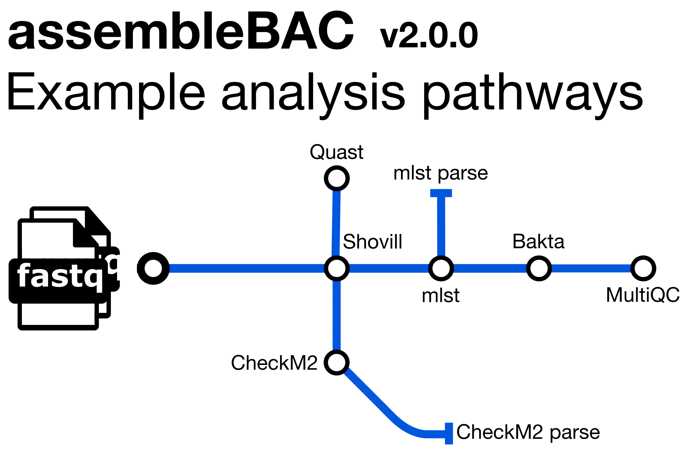

# avantonder/assembleBAC

# 

[](https://doi.org/10.5281/zenodo.15046190)

[](https://www.nextflow.io/)
[](https://docs.conda.io/en/latest/)
[](https://www.docker.com/)
[](https://sylabs.io/docs/)

## Introduction

**avantonder/assembleBAC** is a bioinformatics best-practise analysis pipeline for assembling and annotating bacterial genomes. It also predicts the Sequence Type (ST) and provides QC metrics with `Quast` and `CheckM2`.

1. *de novo* genome assembly ([`Shovill`](https://github.com/tseemann/shovill))
2. Sequence Type assignment ([`mlst`](https://github.com/tseemann/mlst))
3. Annotation ([`Bakta`](https://github.com/oschwengers/bakta))
4. Assembly metrics ([`Quast`](https://quast.sourceforge.net/))
5. Assembly completeness ([`CheckM2`](https://github.com/chklovski/CheckM2))
6. Assembly metrics, annotation and pipeline information ([`MultiQC`](http://multiqc.info/))

## Usage

> [!NOTE]
> If you are new to Nextflow and nf-core, please refer to [this page](https://nf-co.re/docs/usage/installation) on how to set-up Nextflow. Make sure to [test your setup](https://nf-co.re/docs/usage/introduction#how-to-run-a-pipeline) with `-profile test` before running the workflow on actual data.

You will need to Download the `Bakta` light database (`Bakta` version **1.10.4** is required to run the `amrfinder_update` command):

```bash
wget https://zenodo.org/record/7669534/files/db-light.tar.gz
tar -xzf db-light.tar.gz
rm db-light.tar.gz
amrfinder_update --force_update --database db-light/amrfinderplus-db/
```

Additionally, you will need to download the `CheckM2` database (`CheckM2` is required):

````bash
checkm2 database --download --path path/to/checkm2db
````

An executable Python script called [`fastq_dir_to_samplesheet.py`](https://github.com/avantonder/assembleBAC/blob/main/assets/fastq_dir_to_samplesheet.py) has been provided to auto-create an input samplesheet based on a directory containing FastQ files **before** you run the pipeline (requires Python 3 installed locally) e.g.

```bash
wget -L https://github.com/avantonder/assembleBAC/blob/main/assets/fastq_dir_to_samplesheet.py

python fastq_dir_to_samplesheet.py <FASTQ_DIR> \
    samplesheet.csv \
    -r1 <FWD_FASTQ_SUFFIX> \
    -r2 <REV_FASTQ_SUFFIX>
```

```csv title="samplesheet.csv"
sample,fastq_1,fastq_2
SAMPLE_PAIRED_END,/path/to/fastq/files/sample1_1.fastq.gz,/path/to/fastq/files/sample1_2.fastq.gz
SAMPLE_SINGLE_END,/path/to/fastq/files/sample2.fastq.gz, 
```

Alternatively the samplesheet.csv file created by [`nf-core/fetchngs`](https://nf-co.re/fetchngs) can also be used.

Now you can run the pipeline using:

```bash
nextflow run avantonder/assembleBAC \
    -profile singularity \
    -c <INSTITUTION>.config \
    --input samplesheet.csv \
    --genome_size <ESTIMATED GENOME SIZE e.g. 4M> \
    --outdir <OUTDIR> \
    --baktadb path/to/baktadb/dir \
    --checkm2db path/to/checkm2db/diruniref100.KO.1.dmnd \
    -resume
```

See [usage docs](docs/usage.md) for all of the available options when running the pipeline.

## Documentation

The avantonder/assembleBAC pipeline comes with documentation about the pipeline [usage](docs/usage.md), [parameters](docs/parameters.md) and [output](docs/output.md).

## Credits

avantonder/assembleBAC was originally written by Andries van Tonder.  I wouldn't have been able to write this pipeline with out the tools, documentation, pipelines and modules made available by the fantastic [nf-core community](https://nf-co.re/).

## Feedback

If you have any issues, questions or suggestions for improving assembleBAC, please submit them to the [Issue Tracker](https://github.com/avantonder/assembleBAC/issues).

## Citations

If you use the avantonder/assembleBAC pipeline, please cite it using the following doi: [10.5281/zenodo.15046190](https://doi.org/10.5281/zenodo.15046190)

An extensive list of references for the tools used by the pipeline can be found in the [`CITATIONS.md`](CITATIONS.md) file.
